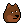

# Doge (Shiba-Inu) Building Blocks

## Doge Series (24×24)

_Shiba Inu dogs - Much wow_

Classic ,
Dark ,
Alien ,
Zombie 

<!-- note:
  sort attributes a-z for now - why? why not?
-->

Attributes (by category and a-z):

- Hat  -
  Bandana ,
  Beanie ,
  Cap  ,
  Cap Forward ,
  Cowboy Hat ,
  Fedora ,
  Headband ,
  Knitted Cap ,
  Tiara ,
  Top Hat 
- Hair -
  Crazy Hair 
- Eyes -
  3D Glasses ,
  Big Shades  ,
  Classic Shades ,
  Eye Patch   ,
  Nerd Glasses  ,
  Regular Shades  ,
  Small Shades  

## Questions? Comments?

Join us in the [Punk Art discord (chat server)](https://discord.gg/FE3HeXNKRa). Yes you can.
Your questions and commentary welcome.

Or post them over at the [Help & Support](https://github.com/geraldb/help) page. Thanks.

